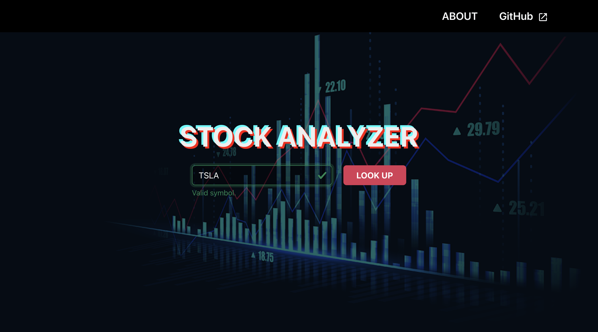
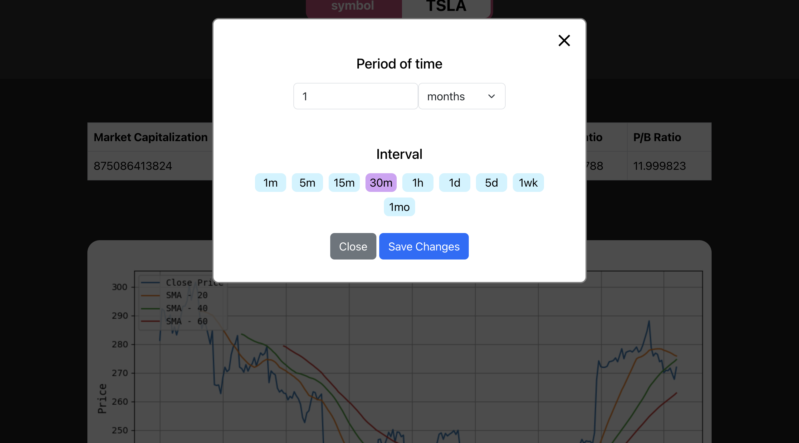

# Stock Analyzer Web Application

## Introduction
Hello, I’m Shun. This is my **CS50x final project**.
The **Stock Analyzer** is a web application designed to help users analyze stock data with financial metrics and customizable technical indicator graphs.
I use [TA-Lib](https://ta-lib.org) and have included its core library in this repository.

## Features
- Search for stock symbols (only stocks, **not** forex or cryptocurrency).
- View **financial metrics** and **graphical data** for selected stocks.
- Generate and customize **technical indicator graphs**.
- Edit, delete, and view details about each technical indicator.

## Installation
### Using Docker (Recommended)
If you have **Docker** installed, you can start the application by running:
```bash
docker-compose up
```
This will automatically set up the necessary environment.
If there's an unexpected error, try following [these steps](#fixing-the-error).

### Manual Installation
If you don't have Docker, you need to install all dependencies manually, including TA-Lib Core, which is written in C/C++.

#### **Install TA-Lib Core**
TA-Lib version 0.6.4 is included inside the `backend/ta-lib` folder. You can install TA-Lib on your local machine by running the following commands after navigating to the `ta-lib` directory:
```bash
tar -xzf ta-lib-0.6.4-src.tar.gz
cd ta-lib-0.6.4
./configure --prefix=/usr
make
sudo make install
```

**⏳ This process may take some time.**

Next, open your terminal and split it into two windows: one for the backend and one for the frontend.

#### **Backend**
```bash
cd backend
```

You can choose to use a Python virtual environment or install the packages globally on your local machine.
```bash
pip3 install -r requirements.txt
```

Then, start the backend server by running the following command:
```bash
python3 run.py
```

#### **Frontend**

Install the required dependencies.
```bash
yarn install
```

Start the frontend server:
```bash
yarn dev
```

## **Fixing the Error (If you are using Docker)**

If you encounter an error, check whether Docker has installed the required libraries. The issue most likely occurs inside the **backend** service.  

### **Step 1: Modify the Configuration**  
1. Open the `config.env` file.  
2. Change the value of `AUTO_START` to any number **other than** `1`.  
3. Run the following command to start the Docker container:  

```bash
docker-compose up -d
```
This will run the Docker container in the background, allowing you to execute commands in Bash.  

---

### **Step 2: Check the Backend Container**  
Enter the backend service:  

```bash
docker-compose exec backend bash
```

Activate the Python virtual environment and install all required packages.  
If the `venv` folder does not exist, create one first:  

```bash
source venv/bin/activate
pip3 install -r requirements.txt
```

Then, check if the `ta-lib` package is installed:  

```bash
pip3 show ta-lib
```

If **no package is found** or you encounter an error, you need to **reinstall TA-Lib core** (which is based on C/C++).  

---

### **Step 3: Reinstall TA-Lib Core**  

#### **1. Modify the Dockerfile**  
Comment out the following lines in `backend/Dockerfile`:  

```dockerfile
# COPY ./ta-lib/lib/* /usr/lib/
# COPY ./ta-lib/include /usr/include/ta-lib
```

#### **2. Restart the Backend Container**  
```bash
exit
docker-compose down backend
docker-compose up -d --build backend
docker-compose exec backend bash
```

#### **3. Install TA-Lib Core Manually**  
Run the following commands inside the backend container:  

```bash
# Remove existing binary files
rm -rf ./ta-lib/include/* ./ta-lib/lib/*

# Install TA-Lib core
cd ta-lib
tar -xzf ta-lib-0.6.4-src.tar.gz
cd ta-lib-0.6.4
./configure --prefix=/usr
make
make install
```
**⏳ This process may take some time.**  

---

### **Step 4: Save the Files for Future Use**  
To make future setups faster, copy the installed files to your local machine:  

```bash
cp /usr/lib/libta-lib* /main/ta-lib/lib
cp /usr/include/ta-lib/* /main/ta-lib/include
```

---

### **Step 5: Install TA-Lib Python Package**
Before proceeding, make sure the Python virtual environment is activated:

```bash
source venv/bin/activate
pip3 install ta-lib==0.6.3
```

---

### **Step 6: Rebuild Docker with Automation**
After you have installed TA-Lib Python Package, follow these steps.
1. Go back to `backend/Dockerfile` and **remove the comments** from the lines you modified earlier.  
2. Change the `AUTO_START` value to `1` inside the `config.env` file.
3. Rebuild the Docker container by running the following commands.

```bash
exit
docker-compose down
docker-compose up --build
```


## Usage
1. After starting the app, visit:
   ```
   http://localhost:8000
   ```
2. Enter a **stock symbol** in the search bar. *(Only stock symbols are supported, not forex or crypto.)*
3. The input field will verify if the symbol is valid.
4. Click **"Look Up"** to navigate to the analysis page.
5. View **financial metrics** and **graphs**.
6. Click the **plus (+) button** to add a **technical indicator graph**.
7. Customize input values and confirm changes.
8. Edit, delete, or view information about technical indicators as needed.

## Preview

**Home page**


**Analyzer**


## License
This project is open-source under the **MIT License**.
